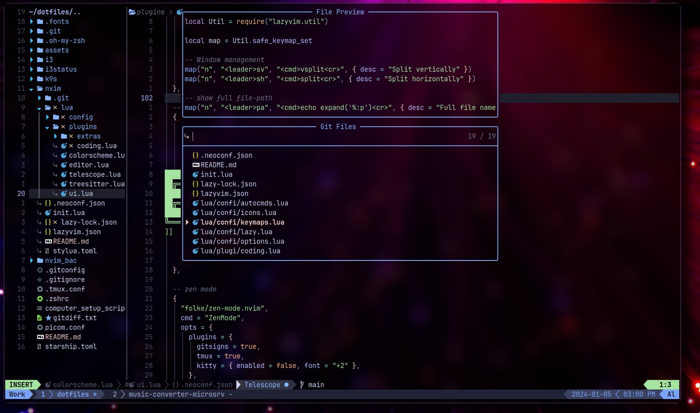
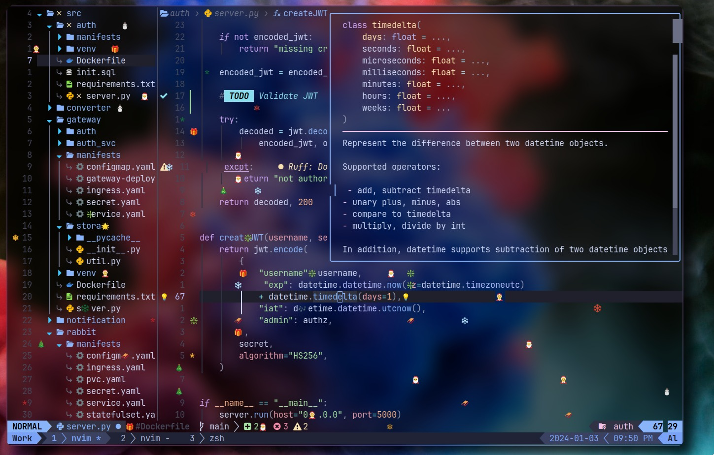

# Dotfiles Repository

Welcome to my dotfiles repository! This space houses configurations for various tools and applications that I use daily.




## Tools and Applications I Use

### Window Manager

- **i3**: My window manager of choice. The configuration is located in [i3/config](i3/config).

### Status Bar

- **i3status**: The status bar configuration is available in [i3status/config](i3status/config).

### Terminal Multiplexer

- **wezterm**: I've switched to using WezTerm as my default terminal. Configuration files are in [wezterm](https://github.com/HeyBadAl/dotfiles/tree/main/wezterm).

### Neovim

- **LazyVim**: I've adopted LazyVim, a preconfigured Neovim distribution. This choice streamlines my Neovim setup and includes various enhancements out of the box.

### Compositor

- **picom**: A compositor for X11. Configuration file is named [picom.conf](picom.conf).

### Prompt

- **Powerlevel10k**: I've switched to using Powerlevel10k as my prompt, providing a highly customizable and feature-rich prompt experience.
- **Starship**(Not Using Anymore): A minimal, fast, and customizable prompt. The configuration file is [starship.toml](starship.toml).

### Other Tools

- **rofi**: As my application launcher.
- **lazygit**: A terminal-based UI for Git.
- **.p10k.zsh**: My Zsh theme configuration.
- **tmux**: Terminal multiplexer for enhanced terminal sessions.
- **neofetch**: Configuration for displaying system information

## How to Use

Feel free to explore and adapt these configurations to suit your preferences. To use them:

1. Clone the repository.

   ```bash
   git clone https://github.com/yourusername/dotfiles.git
   ```

2. Copy or symlink the desired configuration files to the appropriate locations in your system.
